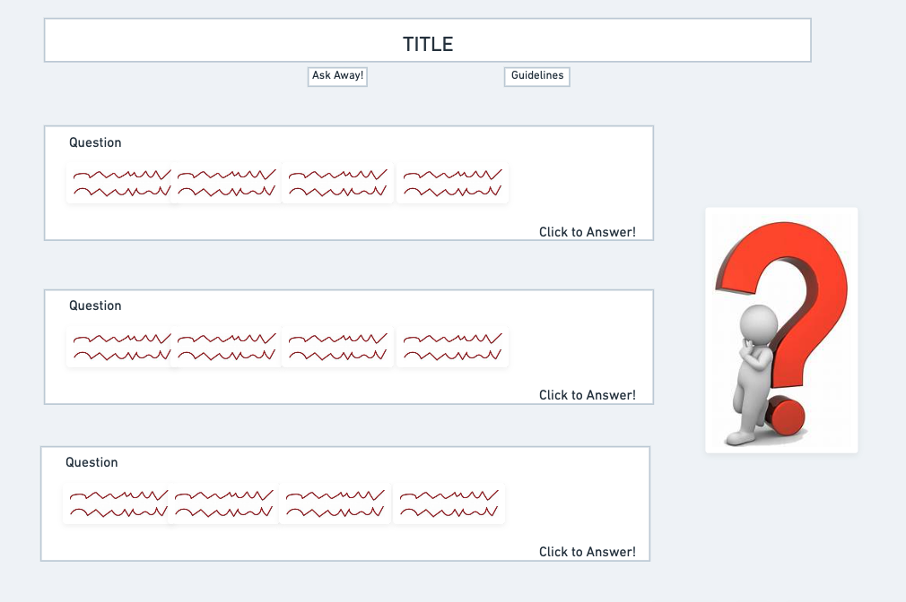
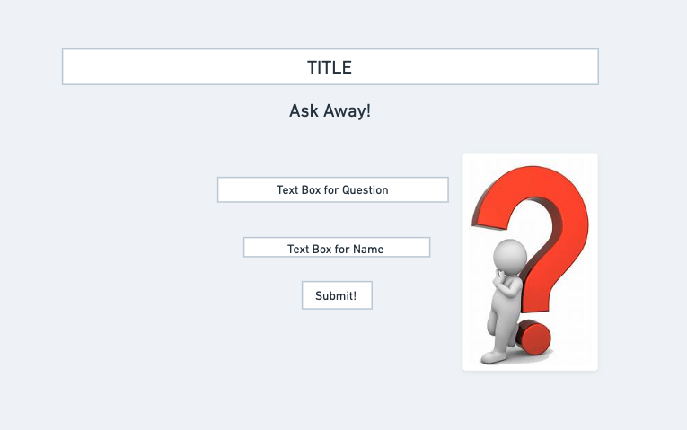

# Project Overview

## Project Name

[The More You Know](https://the-more-you-know.netlify.app)

## Project Description

This site allows users to ask and answer any question that they find interesting. Users can answer others' questions, and can answer the questions that will be provided on the site.

## Wireframes






## Component Hierarchy


## API and Data Sample

```json
{
  "records": [
    {
      "id": "rec5rR5Ekms3RThAT",
      "fields": {
        "question": "Do you think that there are aliens in our solar system? Why? ",
        "author": "Jeshaiah Miller"
      },
      "createdTime": "2021-12-02T04:14:14.000Z"
    },
    {
      "id": "rec404toJmbp6UJwt",
      "fields": {
        "question": "What is something that you thought was cool when you were a kid, but isn't cool now?",
        "author": "Jeshaiah Miller"
      },
      "createdTime": "2021-12-02T04:14:14.000Z"
    },
    {
      "id": "recCP066ROvcYit18",
      "fields": {
        "question": "What are some ideas that you have that would improve the economy?",
        "author": "Jeshaiah Miller"
      },
      "createdTime": "2021-12-02T04:14:14.000Z"
    }
  ],
  "offset": "itrnUtFJkPJybSaON/recCP066ROvcYit18"
}
```

### MVP/PostMVP

#### MVP

- Use Airtable to create and render API.
- Create home page with functional routes.
- Allow users to reply to questions from the home page.
- Allow users to create their own questions.
- Create a page with a list of guidelines.

#### PostMVP

- Create a page for a daily vote. This would require a second airtable api.
- Add additional styling.
- Create functionality for buttons/icons.

## Project Schedule

| Day     | Deliverable                                            | Status   |
| ------- | ------------------------------------------------------ | -------- |
| Dec 1   | Prompt / Wireframes / Component Hierarchy / Timeframes | Complete |
| Dec 2   | Project Approval                                       | complete |
| Dec 3-4 | Core Application Structure (HTML, CSS, etc.)           | complete |
| Dec 3-5 | Pseudocode / actual code / API                         | complete |
| Dec 6-7 | Initial Clickable Model                                | complete |
| Dec 8   | MVP                                                    | complete |
| Dec 9   | Presentations                                          | complete |

## Timeframes

| Component             | Priority | Estimated Time | Time Invested | Actual Time |
| --------------------- | :------: | :------------: | :-----------: | :---------: |
| Airtable              |    H     |      1hrs      |     1hrs      |    1hrs     |
| Pseudocoding          |    H     |      3hrs      |     3hrs      |    3hrs     |
| Calling Api           |    H     |      2hrs      |     2hrs      |    2hrs     |
| Form componenet       |    H     |      3hrs      |     3hrs      |    3hrs     |
| Home component        |    H     |      3hrs      |     3hrs      |    3hrs     |
| Questions component   |    H     |      3hrs      |     3hrs      |    3hrs     |
| Guidelines componenet |    H     |      2hrs      |     2hrs      |    2hrs     |
| Home styling          |    H     |      3hrs      |     3hrs      |    3hrs     |
| Form styling          |    H     |      2hrs      |     2hrs      |    2hrs     |
| questions styling     |    H     |      3hrs      |     3hrs      |    3hrs     |
| Guidelines styling    |    H     |      2hrs      |     2hrs      |    2hrs     |
| responsive design     |    H     |      2hrs      |     2hrs      |    2hrs     |
| Routes/Links          |    H     |      3hrs      |     3hrs      |    3hrs     |
| Associations          |    H     |      2hrs      |     2hrs      |    2hrs     |
| Total                 |    H     |     34hrs      |     34hrs     |    34hrs    |

## SWOT Analysis

### Strengths:

I have a good understanding of APIs and how to efficiently render them. I also have a strong-suit in CSS. Finally, I do well with walking through my coding process. This gives me a better understanding for exactly what I am doing.

### Weaknesses:

One weakness is that I need to be more familiar with routes and links. I have a decent understanding with them, but I need more practice.

### Opportunities:

Creating this project will give me the opportunity to seriously test what I have learned during this unit. It will also challenge my creativity and patience.

### Threats:

I already know that a lot of errors will occur during this project, especially with the api. Although errors will come, I will be able to overcome them.
